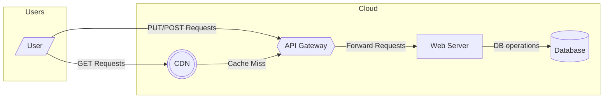
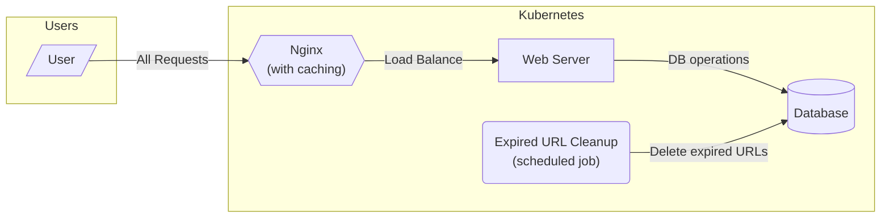

# stoopid-short

[](https://github.com/GregoryConrad/stoopid-short/actions)
[](https://opensource.org/licenses/MIT)

---

A URL shortener written in Rust to learn Kubernetes.
As a side effect, I also ended up learning a ton of Nix.

While you're welcome to self-host `stoopid-short`, I frankly wouldn't recommend it
(at least in the project's current half-productionized state).
There are probably better alternatives out there (but idk, never looked).
You should instead use this repo as an example of best practices--
I tried to follow all of the best practices I could find while developing `stoopid-short`.

## Architecture
The canonical system design for a URL shortener looks something like the following.



But that is all cloud-native; we're here to learn Kubernetes!
Thus, we're dealing with something more like the following (in a self-hosted cluster).



Yes, I'm aware this is not optimal at all in practice/production (we're using NodePort here);
I just wanted to orchestrate a non-trivial Kubernetes cluster.

## Nix
### Developer Environment
Just install Nix + [direnv](https://direnv.net); _the rest will be auto-wired for you_.

To start/stop the local copy of postgres:
```bash
devenv up -d
devenv processes down
```

To run the current local copy of the software:
```bash
nix run .#server # or just "nix run" (for short); starts the web server
nix run .#urlGc # runs the expired URLs garbage collection
```

### Tests
To run all checks + tests (this is exactly what CI runs):
```bash
nix flake check # add -L to get logs in real-time
```

There are currently a few tests, in addition to other validations, running here:
- `checks.${system}.test`: `cargo test` (for unit tests)
- `checks.${system}.e2e`: a comprehensive integration test, run as a derivation,
  that verifies API correctness and fakes the system time to verify proper URL expiry
- `checks.${system}.k8s`: a slower integration test, run in NixOS VMs,
  that validates the current k8s configuration, by simulating a `stoopid-short` cluster

### Container Images
To build container images (resulting image is placed in `./result`):
```bash
nix build .#serverImage # for the web server
nix build .#urlGcImage # for the expired URLs garbage collection cron job

# To load each new image into docker:
docker image load < result
```

## Kubernetes
To initialize a `stoopid-short` cluster,
first build/load the container images from the previous section on all nodes in your cluster.

Then, you may run:
```bash
helm repo add cnpg https://cloudnative-pg.github.io/charts
helm upgrade --install cloudnative-pg --namespace cnpg-system --create-namespace cnpg/cloudnative-pg
helm upgrade --install stoopid-short --namespace stoopid-short --create-namespace charts/stoopid-short
```
